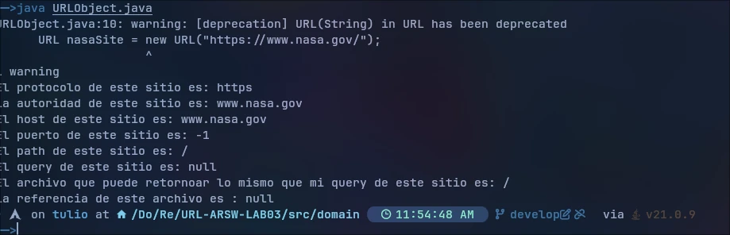
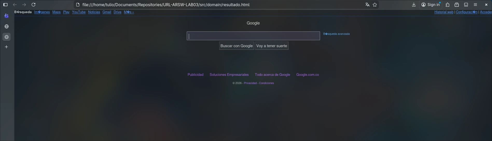

## URL-ARSW-LAB03


## Members:

- Tulio Riaño Sánchez
- Juan Sebastián Puentes Julio

## Technologies Used

- Java 11 or higher
- Standard Java Libraries (java.net, java.io)


## Steps to Run the Project

1. Clone the repository:
	```bash
	git clone https://github.com/your-username/URL-ARSW-LAB03.git
	```
2. Change to the project directory:
	```bash
	cd URL-ARSW-LAB03
	```
3. Ensure you have Java 11 or higher installed on your system.
4. Navigate to the `src/domain` directory:
	```bash
	cd src/domain
	```
5. Compile the Java files:
	```bash
	javac URLObject.java ResultadoHTML.java
	```
6. Run the main class (replace `MainClass` with the actual main class name if different):
	```bash
	java URLObject.java | ResultadoHTML.java
	```
7. Follow the program instructions or check the generated output files (such as `resultado.html`).


## Reading Values of URL Object

First of all, we need to instanciate the **URL Object** with a link to a website in this case. We choose the **Nasa Official Website**. 

Applying the eight methods that this class give us we can observe each one of his results. 



## Reading Websites of Internet 

For this exercise, we are gonna create a file with a extension **.HTML** to read the content of a website, in this case we select the google and this is what we obtain opening the file.

